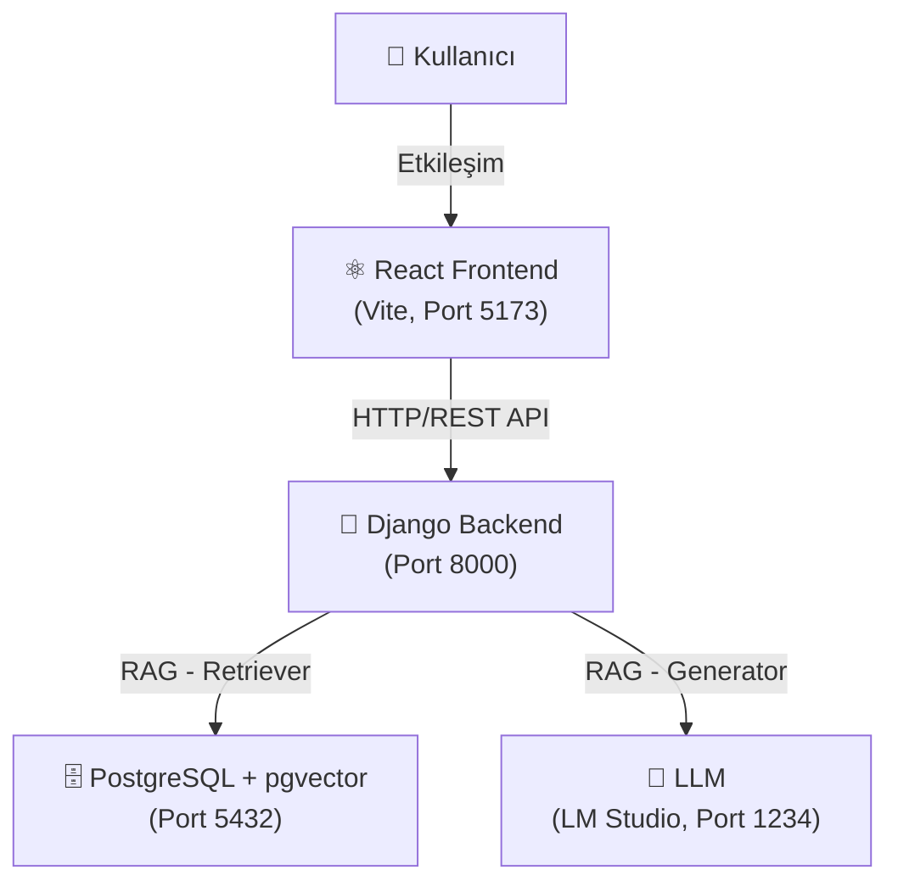

# BrewMind ☕ — Walkthrough

## Ne İnşa Ettik?

**BrewMind**, doğal dilde ("bugün sıcak hava var, buz gibi sütlü bir şey istiyorum") kahve tavsiyesi yapan bir RAG (Retrieval-Augmented Generation) web uygulaması.

### Mimari



---

## Nasıl Çalıştırılır?

### 1. Docker (PostgreSQL) Başlat

```powershell
cd C:\Users\ahmet\Desktop\coding\local_ai_deneme\app
docker compose up -d
```

### 2. LM Studio Başlat

LM Studio'yu açın, **Gemma 4B** (veya desteklenen başka bir model) yükleyin ve Local Server'ı (port 1234) başlatın.

### 3. Django Backend Başlat

```powershell
cd backend
.\venv\Scripts\python manage.py runserver 8000
```

### 4. React Frontend Başlat

```powershell
cd frontend
npm run dev
```

### 5. Tarayıcıda Aç

- **Uygulama**: http://localhost:5173
- **Admin paneli**: http://localhost:8000/admin

---

## Servisler ve URL'ler

| Endpoint                                | Metot                       | Açıklama                 |
| --------------------------------------- | --------------------------- | ------------------------ |
| `/api/coffee/`                          | GET                         | Tüm kahveler             |
| `/api/coffee/<id>/`                     | GET                         | Tek kahve detayı         |
| `/api/coffee/search/`                   | POST `{query}`              | RAG arama                |
| `/api/coffee/<id>/select/`              | POST                        | Sipariş kaydet           |
| `/api/dashboard/stats/`                 | GET                         | KPI istatistikleri       |
| `/api/dashboard/top-coffees/`           | GET                         | En çok sipariş edilenler |
| `/api/dashboard/category-distribution/` | GET                         | Kategori dağılımı        |
| `/api/dashboard/trends/`                | GET `?period=daily\|weekly` | Trend grafik             |
| `/api/dashboard/recent-searches/`       | GET                         | Son aramalar             |

---

## Tamamlanan İşler

### Backend

- ✅ Django 5.1 + DRF — iki app: `coffees`, `dashboard`
- ✅ PostgreSQL + pgvector (Docker ile)
- ✅ `Coffee` modeli — `VectorField(384)` ile embedding depolama
- ✅ `SearchLog` ve `CoffeeOrder` modelleri
- ✅ RAG pipeline: embed → pgvector cosine search → LLM yanıt
- ✅ 20 kahve seed data + embedding'ler oluşturuldu

### Frontend

- ✅ React + Vite + React Router
- ✅ `HomePage`: Doğal dil arama + LLM yanıt balonu + sonuç kartları
- ✅ `DashboardPage`: BarChart, PieChart, LineChart (Recharts) + tablo
- ✅ 20 AI ile oluşturulmuş kahve görseli tamamlandı
- ✅ Dark premium kahve teması

### RAG Sistemi ve LLM Optimizasyonu

- ✅ `all-MiniLM-L6-v2` embedding modeli (384 boyut)
- ✅ pgvector CosineDistance ile benzerlik araması
- ✅ LM Studio entegrasyonu (Gemma gibi Instruct modelleri için optimize edildi)
- ✅ Modelin talimatları (prompt) dışarı sızdırmasını engelleyen katı yönlendirmeler (strict prompting) ve temperature optimizasyonu yapıldı.

---

## Proje Yapısı

```
app/
├── docker-compose.yml
├── .env
├── backend/
│   ├── config/         # Django settings, urls, wsgi
│   ├── coffees/        # Coffee model, views, serializers, seed
│   ├── dashboard/      # Dashboard views
│   ├── rag/            # embeddings.py, retriever.py, generator.py
│   └── requirements.txt
└── frontend/
    ├── src/
    │   ├── components/ # Navbar, SearchBar, CoffeeCard, StatCard
    │   ├── pages/      # HomePage, DashboardPage
    │   └── services/   # api.js (Axios)
    └── public/images/  # AI ile oluşturulmuş 20 kahve görseli
```
