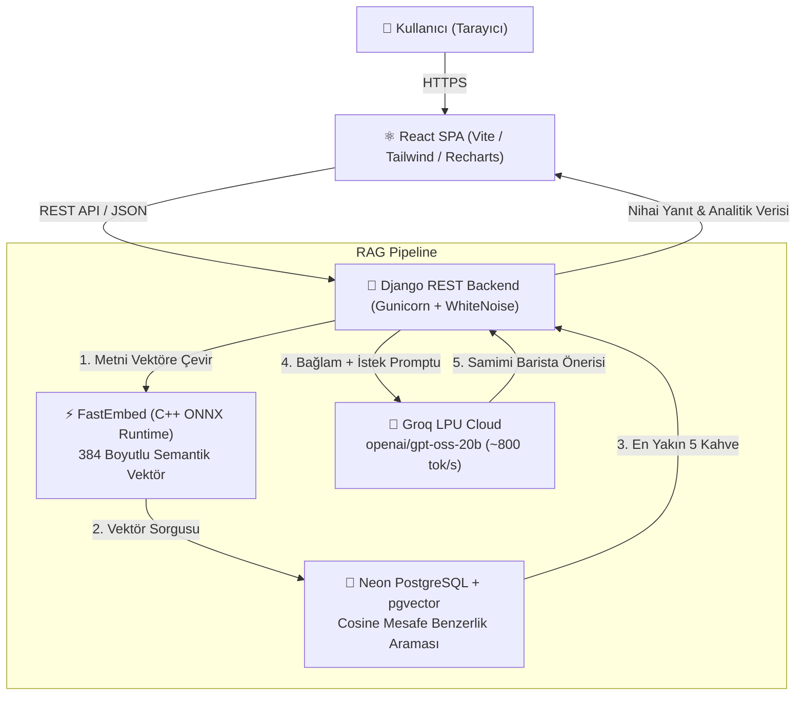

# BrewMind ☕ — Akıllı Kahve Tavsiye & Analitik Platformu

**BrewMind**, doğal dil sorgularını ("*sonbaharda içimi ısıtacak tatlı ve sütlü bir kahve*", "*buz gibi ferahlatıcı hafif bir tat*") vektörlere dönüştürerek anlamsal kahve eşleştirmesi yapan ve yapay zeka baristası ile kişiselleştirilmiş tavsiyeler üreten **RAG (Retrieval-Augmented Generation)** tabanlı bir full-stack web uygulamasıdır.

---

## 🌐 Canlı Sistem (Live Deployment)

Proje bulut üzerinde **%100 ücretsiz ve 7/24 kesintisiz** çalışmaktadır:

- **Canlı Web Uygulaması:** [https://brewmind.onrender.com](https://brewmind.onrender.com)
- **Canlı Django Admin:** [https://brewmind.onrender.com/admin/](https://brewmind.onrender.com/admin/) *(Kullanıcı: `admin` | Şifre: `admin123`)*

| Bileşen | Sağlayıcı / Altyapı | Görev | Durum |
| :--- | :--- | :--- | :--- |
| **Frontend + Backend** | **Render.com** (Frankfurt) | React SPA + Django REST API + WhiteNoise | 🟢 Aktif (Canlıda) |
| **Vektör Veritabanı** | **Neon.tech** (AWS eu-central-1) | PostgreSQL 16 + `pgvector` eklentisi | 🟢 Aktif (Kalıcı) |
| **Metin Vektörleştirme** | **FastEmbed (ONNX)** | `all-MiniLM-L6-v2` (384 boyut, 35 MB RAM) | 🟢 Aktif (Hafif) |
| **LLM (Barista)** | **Groq Cloud (LPU)** | `openai/gpt-oss-20b` (Ultra hızlı çıkarım) | 🟢 Aktif (Canlıda) |
| **Yedek LLM Desteği** | **Google Gemini / LM Studio** | Gemini 3.6 Flash / Yerel Gemma modelleri | ⚪ Yapılandırılabilir |

---

## 🏗️ Sistem Mimarisi




---

## 🚀 Kritik Mühendislik ve Performans Çözümleri

### 1. FastEmbed (ONNX) ile Bellek Optimizasyonu (RAM: 550 MB ➔ 35 MB)
- **Problem:** Standart `sentence-transformers` ve PyTorch kütüphaneleri belleğe yüklendiğinde Linux üzerinde 550 MB'tan fazla RAM tüketiyordu. Bu durum Render'ın ücretsiz 512 MB RAM sınırını aşarak sunucunun kilitlenmesine (`SIGKILL` / `502 Bad Gateway`) yol açıyordu.
- **Çözüm:** Ağır PyTorch bağımlılığı kaldırılarak C++ tabanlı **`fastembed` (ONNX Runtime)** kütüphanesine geçildi. Birebir aynı `all-MiniLM-L6-v2` modeli sıfır PyTorch ile çalıştırıldı.
- **Sonuç:** Bellek tüketimi **%94 azalarak 35 MB'a düştü**; sunucu kararlı ve kesintisiz hale getirildi.

### 2. Groq LPU ile Anlık Yanıt (Sub-Second Inference)
- **Problem:** Standart bulut GPU'larında LLM akıl yürütme ve token üretim süresi 3–4 saniyeyi buluyordu.
- **Çözüm:** Donanım seviyesinde yapay zeka hızlandırma sunan **Groq LPU (Language Processing Unit)** altyapısına geçildi.
- **Sonuç:** Saniyede **800–1000 token** üretim hızı ile barista tavsiyeleri **0.2 – 0.3 saniyede** anında kullanıcıya sunulmaktadır.

### 3. Tek Servis Mimarisi (Single-Service Full-Stack)
- React frontend projesi `npm run build` ile derlenip Django'nun statik dosyalarına dahil edildi.
- **WhiteNoise** ile tek bir Render Web Servisi üzerinden hem REST API hem de React SPA (Client-Side Routing) sıfır CORS problemiyle sunulmaktadır.

---

## ☕ Temel Özellikler

1. **Semantik Kahve Araması:**
   - Kelime eşleşmesi yerine anlam benzerliğini arar. *"Grip oldum şifalı sıcak bir şey"* yazıldığında menüde grip kelimesi geçmese dahi Zencefilli/Baharatlı Chai Latte ve Cortado önerilir.
2. **Yapay Zeka Baristası:**
   - Eşleşen kahvelerin özelliklerini (yoğunluk, tatlılık, süt türü) harmanlayıp kullanıcıya özel 2-3 cümlelik sıcak ve profesyonel bir öneri sunar.
3. **Etkileşimli Analitik Dashboard:**
   - Toplam arama ve sipariş sayıları (KPI).
   - En popüler kahveler (Bar Chart).
   - Kategori dağılımı (Donut/Pie Chart).
   - Günlük/Haftalık arama trendleri (Line Chart).
   - Gerçek zamanlı son arama geçmişi tablosu.
4. **20 Özel Kahve Kartı:**
   - Yapay zeka ile üretilmiş yüksek kaliteli görseller ve lezzet profilleri.

---

## 📡 API Endpointleri

| Endpoint | Metot | Açıklama |
| :--- | :--- | :--- |
| `/api/coffee/` | GET | Menüdeki tüm kahvelerin listesi |
| `/api/coffee/<id>/` | GET | Tek bir kahvenin detayları |
| `/api/coffee/search/` | POST | Doğal dil RAG vektör araması ve LLM önerisi |
| `/api/coffee/<id>/select/` | POST | Kahve siparişi kaydetme |
| `/api/dashboard/stats/` | GET | Dashboard KPI istatistikleri |
| `/api/dashboard/top-coffees/` | GET | En çok sipariş edilen kahveler |
| `/api/dashboard/category-distribution/` | GET | Kategoriye göre sipariş dağılımı |
| `/api/dashboard/trends/?period=daily` | GET | Arama ve sipariş trend grafiği |
| `/api/dashboard/recent-searches/` | GET | Son yapılan aramalar günlüğü |

---

## 💻 Yerel Geliştirme (Local Setup)

### Gereksinimler
- Python 3.11+
- Node.js 18+
- Docker Desktop (Yerel PostgreSQL + pgvector için)

### 1. Projeyi Klonlayın
```bash
git clone https://github.com/ahmeterenzengin/BrewMind.git
cd BrewMind
```

### 2. Veritabanını Başlatın (Docker)
```bash
docker compose up -d
```

### 3. Backend Kurulumu
```bash
cd backend
python -m venv venv
# Windows:
venv\Scripts\activate
# Linux/macOS:
source venv/bin/activate

pip install -r requirements.txt
python manage.py migrate
python manage.py seed_coffees
python manage.py runserver 8000
```

### 4. Frontend Kurulumu
```bash
cd ../frontend
npm install
npm run dev
```

Tarayıcınızda:
- **Uygulama:** `http://localhost:5173`
- **Django Admin:** `http://127.0.0.1:8000/admin/`

---

## 🔐 Güvenlik ve Gizlilik
- Hiçbir API anahtarı veya veritabanı parolası kaynak kodlara gömülmemiştir.
- Tüm gizli değişkenler `.env` dosyası üzerinden okunmakta olup, `.env` dosyaları `.gitignore` ile Git takibinden tamamen izole edilmiştir.
- GitHub Push Protection ve Secret Scanning ile korunmaktadır.

---

## 📂 Dizin Yapısı

```text
BrewMind/
├── backend/
│   ├── coffees/           # Kahve modelleri, arama API'si, seed komutları
│   ├── config/            # Django ayarları, URL yönlendirmeleri, WSGI
│   ├── dashboard/         # Analitik metrikleri ve grafik endpointleri
│   ├── rag/               # FastEmbed embeddings, pgvector retriever, Groq generator
│   └── requirements.txt   # Optimize edilmiş Python paketleri
├── frontend/
│   ├── src/
│   │   ├── components/    # Navbar, SearchBar, CoffeeCard, StatCard vb.
│   │   ├── pages/         # HomePage (Arama) ve DashboardPage (Grafikler)
│   │   └── services/      # Axios API istemcisi
│   └── public/images/     # AI üretimi 20 kahve görseli
├── docker-compose.yml     # Yerel PostgreSQL + pgvector servisi
├── build.sh               # Render derleme betiği
├── .gitignore             # Çevre ve önbellek dosyası filtreleri
└── README.md              # Proje dokümantasyonu
```
